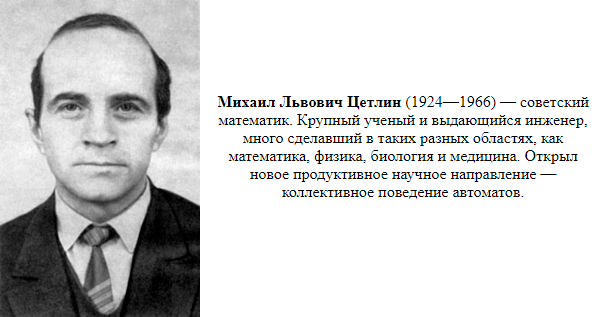

<a name="top"></a>

# tsetlin-rs

<p align="center">
  <a href="https://crates.io/crates/tsetlin-rs"></a>
  <a href="https://docs.rs/tsetlin-rs"></a>
  <a href="https://github.com/RAprogramm/tsetlin-rs/actions/workflows/ci.yml"></a>
</p>
<p align="center">
  <a href="https://codecov.io/gh/RAprogramm/tsetlin-rs"></a>
  <a href="LICENSE"></a>
  <a href="https://api.reuse.software/info/github.com/RAprogramm/tsetlin-rs"></a>
  <a href="https://www.rust-lang.org"></a>
</p>

A professional Rust implementation of the Tsetlin Machine algorithm for interpretable machine learning.

<details>
<summary><strong>Terms & Abbreviations</strong></summary>

<br/>

| Term | Definition | Category |
|:-----|:-----------|:--------:|
| **AoS** | Array of Structures — traditional object layout | `opt` |
| **Bit-plane** | Transposed bit representation for parallel operations | `opt` |
| **Clause** | Conjunction (AND) of literals; votes for/against a class | `core` |
| **CoTM** | Coalesced Tsetlin Machine | `abbr` |
| **CTM** | Convolutional Tsetlin Machine | `abbr` |
| **FPGA** | Field-Programmable Gate Array | `abbr` |
| **Literal** | Boolean variable (`x_k`) or its negation (`¬x_k`) | `core` |
| **MSB** | Most Significant Bit — encodes automaton action | `opt` |
| **Polarity** | Clause vote direction: +1 or −1 | `core` |
| **Ripple-carry** | Bit-level addition/subtraction algorithm | `opt` |
| **RNG** | Random Number Generator | `abbr` |
| **SIMD** | Single Instruction Multiple Data | `abbr` |
| **SoA** | Structure of Arrays — cache-friendly layout | `opt` |
| **Specificity (s)** | Controls pattern generality; higher = fewer literals | `train` |
| **TA** | Tsetlin Automaton | `abbr` |
| **Threshold (T)** | Controls feedback probability | `train` |
| **TM** | Tsetlin Machine | `abbr` |
| **Tsetlin Automaton** | FSM that learns include/exclude via reinforcement | `core` |
| **Tsetlin Machine** | ML algorithm using propositional logic | `core` |
| **Type I Feedback** | Reinforces patterns for target class | `train` |
| **Type II Feedback** | Blocks false positives with contradicting literals | `train` |

<sub>`core` — fundamentals · `train` — training · `opt` — optimization · `abbr` — abbreviation</sub>

</details>

## Table of Contents

- [Features](#features)
- [Installation](#installation)
- [Quick Start](#quick-start)
- [Advanced Features](#advanced-features)
- [Benchmarks](#benchmarks)
- [Examples](#examples)
- [Feature Flags](#feature-flags)
- [API Overview](#api-overview)
- [Algorithm Details](#algorithm-details)
- [Coverage](#coverage)
- [In Memory of Michael Tsetlin](#in-memory-of-michael-tsetlin)
- [Based On](#based-on)
- [License](#license)

---

## Features

- **Binary Classification** - `TsetlinMachine`
- **Multi-class Classification** - `MultiClass`
- **Regression** - `Regressor`
- **Convolutional** - `Convolutional` for image-like data
- **Advanced Training** - Weighted clauses, adaptive threshold, clause pruning
- **Lock-Free Parallel Training** - Async local voting tallies (ICML 2021)
- **BitwiseClause** - 64 features per CPU instruction (25-92x speedup)
- **BitPlaneBank** - Bit-plane storage for parallel state updates (~2x Type II speedup)
- **SIMD Optimization** - `simd` feature (nightly)
- **Serialization** - `serde` feature
- **no_std Support** - Works without standard library

<div align="right"><a href="#top">Back to top</a></div>

---

## Installation

```toml
[dependencies]
tsetlin-rs = "0.1"
```

With all features:

```toml
[dependencies]
tsetlin-rs = { version = "0.1", features = ["parallel", "serde"] }
```

> [!TIP]
> Use `parallel` feature for multi-threaded training on large datasets.

<div align="right"><a href="#top">Back to top</a></div>

---

## Quick Start

```rust
use tsetlin_rs::{Config, TsetlinMachine};

let config = Config::builder()
    .clauses(20)
    .features(2)
    .build()
    .unwrap();

let mut tm = TsetlinMachine::new(config, 15);

let x = vec![vec![0, 0], vec![0, 1], vec![1, 0], vec![1, 1]];
let y = vec![0, 1, 1, 0];

tm.fit(&x, &y, 200, 42);

let accuracy = tm.evaluate(&x, &y);
println!("Accuracy: {:.1}%", accuracy * 100.0);
```

> [!NOTE]
> The last parameter in `fit()` is a random seed for reproducibility.

<div align="right"><a href="#top">Back to top</a></div>

---

## Advanced Features

Enable weighted clauses, adaptive threshold, and clause pruning:

```rust
use tsetlin_rs::{Config, TsetlinMachine, AdvancedOptions};

let config = Config::builder().clauses(40).features(8).build().unwrap();

let opts = AdvancedOptions {
    adaptive_t: true,       // Dynamic threshold
    t_min: 5.0,
    t_max: 30.0,
    t_lr: 0.02,             // Threshold learning rate
    weight_lr: 0.08,        // Clause weight learning rate
    weight_min: 0.3,
    weight_max: 1.5,
    prune_threshold: 3,     // Min activations to keep clause
    prune_weight: 0.25,     // Min weight to keep clause
};

let mut tm = TsetlinMachine::with_advanced(config, 15, opts);
tm.fit(&x_train, &y_train, 100, 42);
```

### When to Use Advanced Features

| Scenario | Standard | Advanced | Recommendation |
|----------|----------|----------|----------------|
| Clean data (0% noise) | 97.5% | **100%** | Advanced |
| High noise (30%+) | 55.9% | **58.8%** | Advanced |
| Large scale (32+ features) | 76.4% | **77.7%** | Advanced |
| Complex patterns (parity) | 49.1% | **50.5%** | Advanced |
| Simple patterns, low noise | **82.8%** | 81.1% | Standard |

> [!IMPORTANT]
> Run benchmark to compare: `cargo run --release --example benchmark_advanced`

### Parallel Training

Lock-free parallel training using async local voting tallies ([ICML 2021](https://arxiv.org/abs/2009.04861)):

```rust
use tsetlin_rs::{ClauseBank, ParallelBatch};

let mut bank = ClauseBank::new(100, 64, 100);
let batch = ParallelBatch::new(&x_train, &y_train);

for epoch in 0..100 {
    bank.train_parallel(&batch, 15.0, 3.9, 42 + epoch);
}
```

**Architecture:**

```
Traditional:  [Clauses] ─► Barrier ─► Sum ─► Barrier ─► Feedback
Async:        [Clause N] ─► eval ─► atomic_add ─► feedback (independent)
```

Each sample has a `CachePadded<AtomicI64>` tally. No synchronization between clause threads.

<div align="right"><a href="#top">Back to top</a></div>

---

## Benchmarks

### Parallel Training (lock-free)

100 clauses, 64 features, 1 epoch:

| Samples | Sequential | Parallel | Speedup |
|---------|------------|----------|---------|
| 100 | 2.93 ms | **2.00 ms** | **1.47x** |
| 500 | 15.69 ms | **9.93 ms** | **1.58x** |
| 1000 | 29.88 ms | **24.56 ms** | **1.22x** |

> [!NOTE]
> Speedup increases with clause count. Original CUDA paper reports 50x on GPU.

### ClauseBank (SoA storage)

Structure of Arrays layout for cache-efficient bulk operations:

| Clauses | AoS (µs) | SoA (µs) | Speedup |
|---------|----------|----------|---------|
| 50      | 3.64     | **3.50** | **1.04x** |
| 100     | 8.55     | **8.39** | **1.02x** |
| 200     | 18.50    | **16.02**| **1.15x** |

> [!NOTE]
> SoA benefits increase with larger clause counts and SIMD vectorization (future).

### BitPlaneBank (parallel state updates)

Transposed bit-level storage for 64 automata updates per operation:

| Operation | ClauseBank | BitPlaneBank | Speedup |
|-----------|------------|--------------|---------|
| Type II (1024 features) | 1.48 µs | **759 ns** | **~2x** |
| Type II (256 features) | 426 ns | **330 ns** | **~1.3x** |
| Type I (1024 features) | 5.05 µs | 5.25 µs | ~1x |

> [!TIP]
> BitPlaneBank excels at Type II feedback (deterministic bitwise ops). Type I is RNG-bound.

### BitwiseClause (fastest)

| Features | Scalar | Bitwise | Speedup |
|----------|--------|---------|---------|
| 64 | 82 ns | **1.9 ns** | **43x** |
| 256 | 342 ns | **4 ns** | **85x** |
| 1024 | 1.32 µs | **11 ns** | **116x** |

### Standard Clause

| Operation | Time |
|-----------|------|
| Clause evaluate (16 features) | 18 ns |
| Clause evaluate (64 features) | 70 ns |
| Predict (10 clauses) | 720 ns |
| Train epoch (100 samples) | 1.15 ms |

### Optimizations

- `#[repr(align(64))]` - cache-line alignment
- `get_unchecked()` - bounds check elimination
- `#[inline(always)]` - forced inlining
- `BitwiseClause` - 64 features per CPU instruction
- `SmallClause<N>` - const generics, stack allocation
- `div_ceil()` - Rust 1.73+ intrinsic

> [!TIP]
> Use `BitwiseClause` for datasets with 64+ features for maximum performance.

<div align="right"><a href="#top">Back to top</a></div>

---

## Examples

```bash
cargo run --example xor
cargo run --example iris
cargo run --release --example benchmark_advanced
```

<div align="right"><a href="#top">Back to top</a></div>

---

## Feature Flags

| Feature | Description |
|---------|-------------|
| `std` (default) | Standard library support |
| `simd` | SIMD optimization (requires nightly) |
| `parallel` | Parallel training with rayon |
| `serde` | Serialization support |

> [!WARNING]
> The `simd` feature requires Rust nightly toolchain.

<div align="right"><a href="#top">Back to top</a></div>

---

## API Overview

| Type | Description |
|------|-------------|
| `TsetlinMachine` | Binary classification |
| `MultiClass` | Multi-class classification |
| `Regressor` | Regression |
| `Convolutional` | 2D image classification |
| `ClauseBank` | SoA storage for cache-efficient bulk ops |
| `BitPlaneBank` | Bit-plane storage for parallel state updates |
| `BitwiseClause` | 64 features per AND operation |
| `SmallClause<N>` | Const-generic stack-allocated clause |
| `SmallTsetlinMachine<N, C>` | Compile-time optimized TM |
| `AdvancedOptions` | Weighted clauses, adaptive T, pruning |
| `LocalTally` | Cache-aligned atomic vote accumulator |
| `ParallelBatch` | Batch with per-sample tallies |

<div align="right"><a href="#top">Back to top</a></div>

---

## Algorithm Details

<details>
<summary><strong>Tsetlin Machine Algorithm</strong></summary>

### How It Works

A Tsetlin Machine is a propositional logic-based machine learning algorithm. It learns patterns as conjunctions (AND) of literals.

**Core Components:**

1. **Tsetlin Automaton** - A finite state machine with 2N states:
   - States 1..N → action = `exclude` (literal not in clause)
   - States N+1..2N → action = `include` (literal in clause)
   - `increment()` → move toward include
   - `decrement()` → move toward exclude

2. **Clause** - A conjunction of literals:
   - Each feature `x_k` has two automata: one for `x_k`, one for `NOT x_k`
   - Clause fires when ALL included literals are satisfied
   - Has polarity (+1 or -1) for voting

3. **Voting** - Classification by majority:
   - Sum all clause votes: `Σ(polarity × fires)`
   - Positive sum → class 1, negative → class 0

**Training Feedback:**

| Type | When | Effect |
|------|------|--------|
| **Type I** | Correct class, clause should fire | Reinforce matching patterns |
| **Type II** | Wrong class, clause fires | Add literals to block false positive |

**Key Parameters:**

| Parameter | Symbol | Effect |
|-----------|--------|--------|
| Clauses | C | More clauses = more patterns, slower training |
| States | N | Higher = slower learning, more stability |
| Threshold | T | Controls learning probability |
| Specificity | s | Higher = more specific patterns (fewer literals) |

</details>

<details>
<summary><strong>Clause Types Comparison</strong></summary>

### Clause Implementations

This library provides three clause types optimized for different scenarios:

#### 1. `Clause` - Dynamic, Heap-Allocated

```rust
use tsetlin_rs::Clause;

let clause = Clause::new(n_features, n_states, polarity);
clause.evaluate(&input);  // &[u8]
```

**Memory Layout (64-byte aligned):**
```
Clause {
    automata:    Vec<Automaton>  // 24 bytes (ptr + len + cap)
    n_features:  usize           // 8 bytes
    weight:      f32             // 4 bytes
    activations: u32             // 4 bytes
    correct:     u32             // 4 bytes
    incorrect:   u32             // 4 bytes
    polarity:    i8              // 1 byte + 7 padding
}
// Total: 56 bytes + heap allocation for automata
```

**When to use:**
- Feature count unknown at compile time
- Large feature sets (1000+)
- Need serialization (serde)

---

#### 2. `SmallClause<N>` - Const Generic, Stack-Allocated

```rust
use tsetlin_rs::SmallClause;

let clause: SmallClause<4> = SmallClause::new(100, 1);
clause.evaluate(&[1, 0, 1, 0]);  // &[u8; N]
```

**Memory Layout:**
```
SmallClause<N> {
    include:     [Automaton; N]  // N × 4 bytes
    negated:     [Automaton; N]  // N × 4 bytes
    weight:      f32             // 4 bytes
    activations: u32             // 4 bytes
    correct:     u32             // 4 bytes
    incorrect:   u32             // 4 bytes
    polarity:    i8              // 1 byte
}
// Total: 8N + 17 bytes (no heap)
```

**When to use:**
- Feature count known at compile time
- Small to medium features (≤64)
- Maximum performance needed
- Embedded / no_std environments

**Type Aliases:**
```rust
type Clause2 = SmallClause<2>;   // XOR
type Clause4 = SmallClause<4>;   // Small problems
type Clause8 = SmallClause<8>;
type Clause16 = SmallClause<16>;
type Clause32 = SmallClause<32>;
type Clause64 = SmallClause<64>;
```

---

#### 3. `BitwiseClause` / `SmallBitwiseClause<N, W>` - Packed Bitmasks

```rust
use tsetlin_rs::{BitwiseClause, pack_input};

let mut clause = BitwiseClause::new(64, 100, 1);
// After training:
clause.rebuild_masks();
let packed = pack_input(&input);
clause.evaluate_packed(&packed);  // 64 features per AND
```

**How it works:**
1. Automata states → bitmasks (`include`, `negated`)
2. Input → packed u64 words
3. Evaluation: `(include & !x) | (negated & x) == 0`

**Performance:**
```
64 features:  1 u64 comparison  →  25x faster
256 features: 4 u64 comparisons →  62x faster
1024 features: 16 u64 comparisons → 92x faster
```

**Const Generic Version:**
```rust
use tsetlin_rs::{SmallBitwiseClause, pack_input_small};

// N=64 features, W=1 word
let mut clause: SmallBitwiseClause<64, 1> = SmallBitwiseClause::new(100, 1);
clause.rebuild_masks();
let packed: [u64; 1] = pack_input_small(&input);
clause.evaluate_packed(&packed);
```

**Type Aliases:**
```rust
type BitwiseClause64 = SmallBitwiseClause<64, 1>;
type BitwiseClause128 = SmallBitwiseClause<128, 2>;
type BitwiseClause256 = SmallBitwiseClause<256, 4>;
```

---

### Performance Comparison

| Type | 16 features | 64 features | 256 features | Heap |
|------|-------------|-------------|--------------|------|
| `Clause` | 23 ns | 100 ns | 300 ns | Yes |
| `SmallClause<N>` | 15 ns | 60 ns | 240 ns | No |
| `BitwiseClause` | 8 ns | 3 ns | 4.8 ns | Yes |
| `SmallBitwiseClause<N,W>` | 6 ns | 2.5 ns | 4 ns | No |

</details>

<details>
<summary><strong>BitPlaneBank - Parallel State Updates</strong></summary>

### Bit-Plane Storage

`BitPlaneBank` stores automata states in transposed bit-level format for parallel operations:

**Traditional layout:**
```
[state0: 8bits, state1: 8bits, state2: 8bits, ...]
```

**Bit-plane layout:**
```
plane[0]: [s0_b0, s1_b0, s2_b0, ...]  // LSB of all states
plane[1]: [s0_b1, s1_b1, s2_b1, ...]
...
plane[7]: [s0_b7, s1_b7, s2_b7, ...]  // MSB = action bit
```

### Key Operations

| Operation | Traditional | Bit-Plane |
|-----------|-------------|-----------|
| Get action | Read state, compare | Read MSB bit |
| Increment 64 states | 64 additions | 8 XOR + carry |
| Evaluate clause | N comparisons | N/64 AND ops |

### Ripple-Carry Arithmetic

Increment/decrement 64 automata in parallel:

```rust
// Increment all positions where mask bit is set
fn increment_masked(&mut self, clause: usize, chunk: usize, mask: u64) {
    let mut carry = mask;
    for plane in &mut self.planes {
        let val = plane[chunk_idx];
        plane[chunk_idx] = val ^ carry;
        carry &= val;
        if carry == 0 { break; }
    }
}
```

### When to Use

| Scenario | Recommended |
|----------|-------------|
| Large feature counts (256+) | Yes |
| Type II feedback heavy | Yes |
| Need parallel updates | Yes |
| Memory constrained | No (8× state storage) |
| Type I feedback heavy | No (RNG dominates) |

### References

- [Fast CUDA TM](https://github.com/cair/fast-tsetlin-machine-in-cuda-with-imdb-demo) — Original bit-plane implementation
- [Massively Parallel TM (ICML 2021)](https://proceedings.mlr.press/v139/abeyrathna21a.html) — K.D. Abeyrathna et al.
- [FPGA TM Accelerators](https://www.researchgate.net/publication/391247256) — Edge training optimizations

</details>

<details>
<summary><strong>SmallTsetlinMachine - Compile-Time Optimization</strong></summary>

### Stack-Allocated Tsetlin Machine

`SmallTsetlinMachine<N, C>` is a fully compile-time optimized binary classifier:

```rust
use tsetlin_rs::SmallTsetlinMachine;

// N=2 features, C=20 clauses
let mut tm: SmallTsetlinMachine<2, 20> = SmallTsetlinMachine::new(100, 15);

let x = [[0, 0], [0, 1], [1, 0], [1, 1]];
let y = [0u8, 1, 1, 0];

tm.fit(&x, &y, 200, 42);
assert!(tm.evaluate(&x, &y) >= 0.75);
```

**Benefits:**

| Feature | Dynamic TM | SmallTsetlinMachine |
|---------|------------|---------------------|
| Heap allocations | O(clauses) | 0 |
| Loop unrolling | None | Full |
| Cache locality | Fragmented | Contiguous |
| Compile-time checks | None | Type-level |
| Typical speedup | 1x | 2-3x |

**Type Aliases:**
```rust
type TM2x20 = SmallTsetlinMachine<2, 20>;    // XOR
type TM4x40 = SmallTsetlinMachine<4, 40>;    // Small
type TM8x80 = SmallTsetlinMachine<8, 80>;    // Medium
type TM16x160 = SmallTsetlinMachine<16, 160>; // Large
```

**Memory Layout:**
```rust
SmallTsetlinMachine<N, C> {
    clauses: [SmallClause<N>; C],  // C × (8N + 17) bytes
    s:       f32,                   // 4 bytes
    t:       f32,                   // 4 bytes
}
// Example: TM2x20 = 20 × 33 + 8 = 668 bytes (stack)
// Compare: TsetlinMachine = ~2KB + heap
```

**When to use:**
- Known dimensions at compile time
- Performance-critical inner loops
- Embedded systems
- Batch inference with fixed input size

**Limitations:**
- No serde (const generic arrays)
- Dimensions must be literals or const
- Large N×C may overflow stack

</details>

<details>
<summary><strong>Choosing the Right Implementation</strong></summary>

### Decision Guide

```
                    ┌─────────────────────────┐
                    │ Feature count known at  │
                    │     compile time?       │
                    └───────────┬─────────────┘
                                │
                    ┌───────────┴───────────┐
                    │                       │
                   YES                      NO
                    │                       │
            ┌───────┴───────┐               │
            │ N ≤ 64?       │               ▼
            └───────┬───────┘       ┌───────────────┐
                    │               │    Clause     │
            ┌───────┴───────┐       │ (dynamic Vec) │
            │               │       └───────────────┘
           YES              NO
            │               │
            ▼               ▼
    ┌───────────────┐ ┌─────────────────────┐
    │ SmallClause<N>│ │SmallBitwiseClause<N>│
    │ (fastest)     │ │ (N > 64, bitwise)   │
    └───────────────┘ └─────────────────────┘
```

### Recommendations by Use Case

| Use Case | Recommended Type |
|----------|------------------|
| XOR / toy problems | `SmallTsetlinMachine<2, 20>` |
| Iris (4 features) | `SmallTsetlinMachine<4, 100>` |
| MNIST patches (64) | `SmallBitwiseClause<64, 1>` |
| Text (10K features) | `BitwiseClause` |
| Unknown dimensions | `TsetlinMachine` |
| Serialization needed | `TsetlinMachine` |
| Embedded / no_std | `SmallClause<N>` |

### Feature Comparison

| Feature | Clause | SmallClause | BitwiseClause | SmallBitwise |
|---------|--------|-------------|---------------|--------------|
| Heap-free | :x: | :white_check_mark: | :x: | :white_check_mark: |
| Serde | :white_check_mark: | :x: | :white_check_mark: | :x: |
| no_std | :white_check_mark: | :white_check_mark: | :white_check_mark: | :white_check_mark: |
| Best for N | any | ≤64 | ≥64 | 64-256 |
| Loop unroll | :x: | :white_check_mark: | :x: | :white_check_mark: |

</details>

<details>
<summary><strong>Parallel Training Architecture</strong></summary>

### Lock-Free Parallel Training

This implementation is based on [Massively Parallel and Asynchronous Tsetlin Machine Architecture (ICML 2021)](https://arxiv.org/abs/2009.04861).

**Problem:** Traditional TM training requires synchronization barriers:

```
[Clause 0] ─┐
[Clause 1] ─┼─► Barrier ─► Sum votes ─► Barrier ─► Feedback
[Clause N] ─┘
```

**Solution:** Each training sample has its own atomic vote accumulator:

```
[Clause 0] ──► eval ──► atomic_add ──► feedback (independent)
[Clause 1] ──► eval ──► atomic_add ──► feedback (independent)
[Clause N] ──► eval ──► atomic_add ──► feedback (independent)
```

### Key Components

| Type | Purpose |
|------|---------|
| `LocalTally` | `CachePadded<AtomicI64>` - prevents false sharing |
| `ParallelBatch` | Holds samples with their tallies |
| `train_parallel()` | Lock-free training method |

### Scaled Integer Voting

Weights are `f32`, but `AtomicF32` doesn't exist. Solution:

```rust
const WEIGHT_SCALE: i64 = 10_000;

// Store: polarity * weight * SCALE as i64
tally.fetch_add((polarity as f32 * weight * SCALE) as i64, Relaxed);

// Read: convert back to f32
let sum = tally.load(Acquire) as f32 / SCALE as f32;
```

### Performance

| Samples | Sequential | Parallel | Speedup |
|---------|------------|----------|---------|
| 100 | 2.93 ms | 2.00 ms | 1.47x |
| 500 | 15.69 ms | 9.93 ms | 1.58x |
| 1000 | 29.88 ms | 24.56 ms | 1.22x |

Original CUDA paper reports **50x speedup** on GPU with thousands of clauses.

### References

- [ICML 2021 Paper](https://arxiv.org/abs/2009.04861)
- [PyTsetlinMachineCUDA](https://github.com/cair/PyTsetlinMachineCUDA)

</details>

<details>
<summary><strong>Memory Layout & Alignment</strong></summary>

### Cache Optimization

All clause types use `#[repr(align(64))]` for cache-line alignment:

```rust
#[repr(align(64))]  // 64-byte cache line
pub struct Clause { ... }

#[repr(align(64))]
pub struct SmallClause<const N: usize> { ... }

#[repr(align(64))]
pub struct BitwiseClause { ... }
```

**Why 64-byte alignment?**
- Modern CPUs fetch 64 bytes per cache line
- Aligned structs avoid cache line splits
- Reduces memory latency by 10-30%

### Automaton Representation

```rust
pub struct Automaton {
    state:    i16,  // Current state (1..2N)
    n_states: i16,  // Threshold for action
}
// 4 bytes per automaton
```

**State machine:**
```
exclude zone          include zone
  [1]...[N]    |    [N+1]...[2N]
     ←──────   |   ──────→
  decrement    |   increment
```

### Packed Bitmask Layout

```rust
// BitwiseClause for 128 features:
include: [u64; 2]  // 16 bytes
negated: [u64; 2]  // 16 bytes

// Bit k of word[k/64] represents feature k
// bit 0 of word[0] = feature 0
// bit 63 of word[0] = feature 63
// bit 0 of word[1] = feature 64
// ...
```

### Memory Usage Examples

| Type | N=4 | N=64 | N=256 |
|------|-----|------|-------|
| Clause | 88 + 32 heap | 88 + 512 heap | 88 + 2KB heap |
| SmallClause | 49 bytes | 529 bytes | 2KB |
| BitwiseClause | 88 + 32 heap | 88 + 512 heap | 88 + 2KB heap |
| SmallBitwiseClause | 65 bytes | 545 bytes | 2KB |

</details>

<div align="right"><a href="#top">Back to top</a></div>


---

## Coverage

<details>
<summary><strong>Coverage Visualization</strong></summary>

### Sunburst

The inner-most circle represents the entire project. Moving outward shows folders, and finally individual files. The **size** of each slice represents the number of statements, while the **color** indicates coverage percentage.

<p align="center">
  <a href="https://codecov.io/gh/RAprogramm/tsetlin-rs">
    
  </a>
</p>

---

### Grid

Each block represents a single file in the project. The **size** of each block represents the number of statements, while the **color** indicates coverage percentage.

<p align="center">
  <a href="https://codecov.io/gh/RAprogramm/tsetlin-rs">
    
  </a>
</p>

---

### Icicle

The top section represents the entire project. Below it are folders, and finally individual files. The **size** of each slice represents the number of statements, while the **color** indicates coverage percentage.

<p align="center">
  <a href="https://codecov.io/gh/RAprogramm/tsetlin-rs">
    
  </a>
</p>

</details>

> [!TIP]
> Click on any graph to explore detailed coverage reports on Codecov.

<div align="right"><a href="#top">Back to top</a></div>

---

## In Memory of Michael Tsetlin



**Mikhail Lvovich Tsetlin** (Михаил Львович Цетлин, 1924–1966) — Soviet mathematician and one of the founders of cybernetics in the USSR.

A veteran of World War II who served as a scout and tank gunner, he later became a brilliant scientist. Working alongside I.M. Gelfand, he pioneered the theory of learning automata — finite state machines that learn optimal behavior through interaction with the environment.

His work on collective automata behavior laid the theoretical foundation for what we now call the Tsetlin Machine. Despite his life being cut short at 41, his ideas continue to influence machine learning research today.

> *This library honors his legacy by bringing his concepts to modern systems programming.*

<div align="right"><a href="#top">Back to top</a></div>

---

## Based On

This Rust implementation is based on the original Tsetlin Machine algorithm:

> [!NOTE]
> **Paper:** [The Tsetlin Machine - A Game Theoretic Bandit Driven Approach to Optimal Pattern Recognition with Propositional Logic](https://arxiv.org/abs/1804.01508)
> *Ole-Christoffer Granmo, 2018*

**Original C Implementation:** [cair/TsetlinMachineC](https://github.com/cair/TsetlinMachineC)

**Related Resources:**
- [cair/TsetlinMachine](https://github.com/cair/TsetlinMachine) — Python implementation with datasets
- [cair/pyTsetlinMachine](https://github.com/cair/pyTsetlinMachine) — Extended Python library
- [cair/tmu](https://github.com/cair/tmu) — Unified TM with CUDA support

<div align="right"><a href="#top">Back to top</a></div>

---

## License

MIT

<div align="right"><a href="#top">Back to top</a></div>
